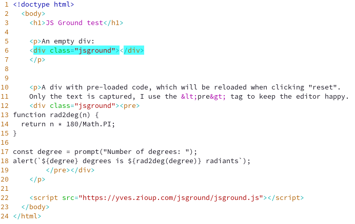
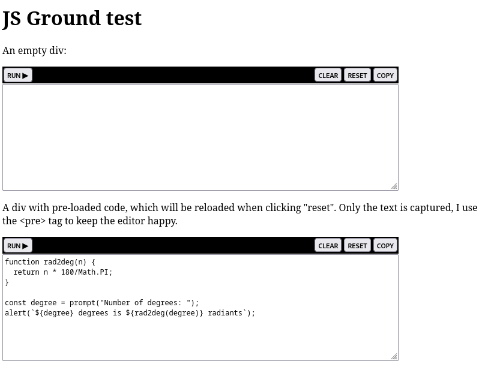

# JS Ground

## Purpose
Add an extremely simple JavaScript playground to an HTML5 file by just adding &lt;div &gt;and a link to `jsground.js`.

## Notes
* Your page should not have class names starting with the string "jsground" to avoid conflict.
* The browser console is not captured, errors and console messages will go to the browser console.
* Unlike the browser console, the code can be rerun even with `conts` and `let` keywords (the code is wrapped in a function before it is run).
* The playground is just an html text area, there is not code completion nor formatting.

## Build
Requirement: `node`

Run: `./build-jsground.js`

## Usage
* Add the following line as the last line of your html body (use your own URL): `<script src="https://yves.zioup.com/jsground/jsground.js"></script>`
* Add one or multiple div tags with the class "jsground": `<div class="jsground"></div>`
* Optionally, if you add text inside the div, it will be in the playground at load, and when cleared:
```
<div class="jsground"><pre>
const name = "World";
console.log(`Hello ${name}`)
</pre></div>
```

## Example
[jsground-example file](example/jsground-example.html) rendering in editor and browser:  
 


## TODO
* Add an option to not use "use strict"
* check for conflicting class and script names and fail.
* confirm the dev console cannot be opened via JavaScript
* add warning that messages and errors go to the browser console
* Add an inline editor, code completion?
* Switch to a proper build (there was going to be no build, then a really small one, then the wheel was reinvented...)
* Possibly switch to a light framework
